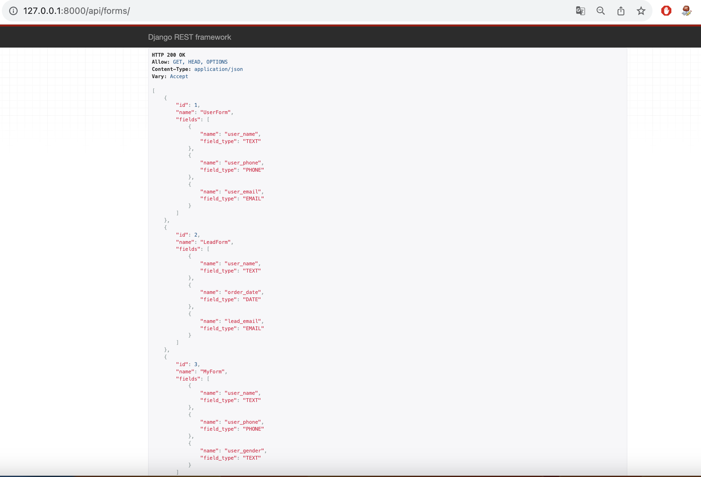
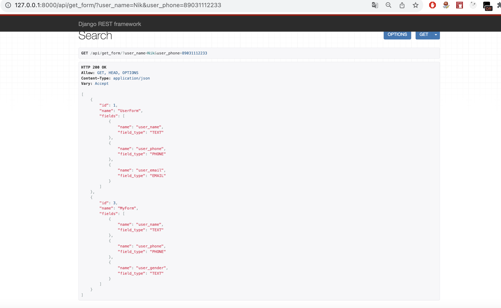
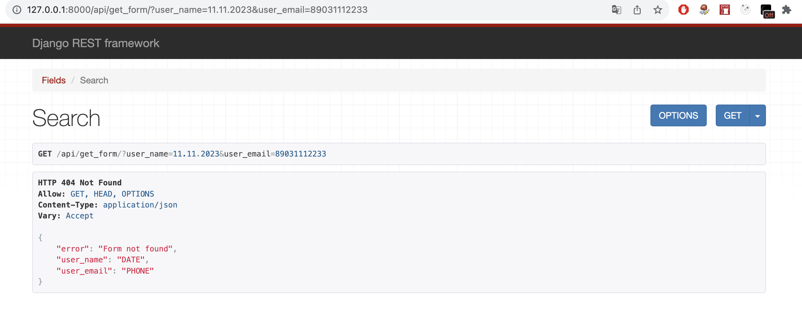
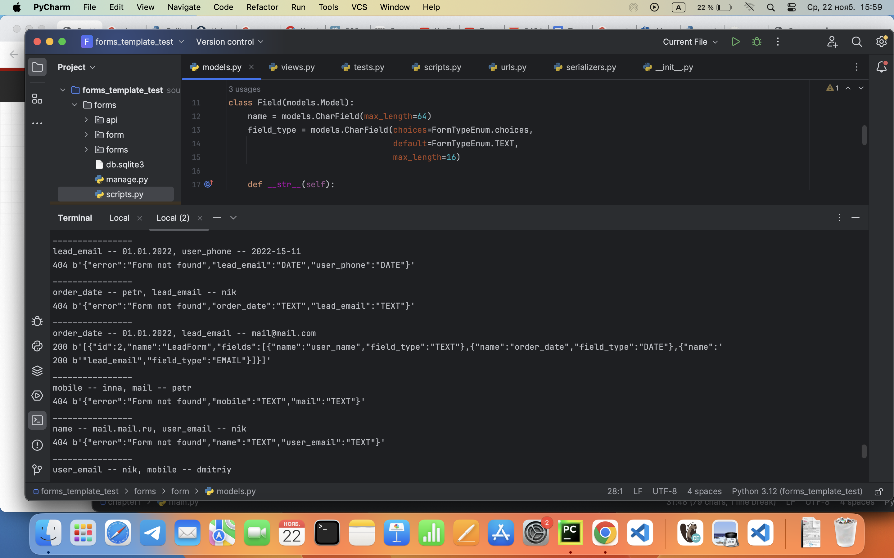

## Web-приложение для определения заполненных форм.

В базе данных хранится список шаблонов форм.


Шаблон формы, это структура, которая задается уникальным набором полей, с указанием их типов.


Пример шаблона формы:


{

    "name": "Form template name",

    "field_name_1": "email",

    "field_name_2": "phone"

}

На вход по урлу /get_form GET запросом передаются данные такого вида:

##### f_name1=value1&f_name2=value2


В ответ нужно вернуть имя шаблона формы, если она была найдена.

Чтобы найти подходящий шаблон нужно выбрать тот, поля которого совпали с полями в присланной форме. Совпадающими считаются поля, у которых совпали имя и тип значения. Полей в пришедшей форме может быть больше чем в шаблоне, в этом случае шаблон все равно будет считаться подходящим. Самое главное, чтобы все поля шаблона присутствовали в форме.


Если подходящей формы не нашлось, вернуть ответ в следующем формате

{

    f_name1: FIELD_TYPE,
    f_name2: FIELD_TYPE

}

_____

### Все формы




### Поиск

Формы найдены




_____
Формы не найдены



____

Тестовый скрипт



____

### Установка и запуск приложения

```
git clone https://github.com/molodcovnik/form_templates.git

```